# Mermaid ERD - Processus de Vente Star Schema

This diagram shows the main dimensional relationships for the proposed sales-process warehouse.

```mermaid
erDiagram
    DIM_DATE ||--o{ FACT_SALES_ORDER : order_date
    DIM_DATE ||--o{ FACT_SALES_ORDER_LINE : order_date
    DIM_DATE ||--o{ FACT_INVOICE : invoice_date
    DIM_DATE ||--o{ FACT_INVOICE_LINE : invoice_date
    DIM_DATE ||--o{ FACT_DELIVERY : movement_date
    DIM_DATE ||--o{ FACT_DELIVERY_LINE : movement_date
    DIM_DATE ||--o{ FACT_PAYMENT_ALLOCATION : allocation_date
    DIM_DATE ||--o{ FACT_STOCK_SNAPSHOT : snapshot_date

    DIM_CUSTOMER ||--o{ FACT_SALES_ORDER : customer
    DIM_CUSTOMER ||--o{ FACT_SALES_ORDER_LINE : customer
    DIM_CUSTOMER ||--o{ FACT_INVOICE : customer
    DIM_CUSTOMER ||--o{ FACT_INVOICE_LINE : customer
    DIM_CUSTOMER ||--o{ FACT_DELIVERY : customer
    DIM_CUSTOMER ||--o{ FACT_PAYMENT_ALLOCATION : customer

    DIM_COMMERCIAL ||--o{ FACT_SALES_ORDER : commercial
    DIM_COMMERCIAL ||--o{ FACT_SALES_ORDER_LINE : commercial
    DIM_COMMERCIAL ||--o{ FACT_INVOICE : commercial
    DIM_COMMERCIAL ||--o{ FACT_INVOICE_LINE : commercial

    DIM_PRODUCT ||--o{ FACT_SALES_ORDER_LINE : product
    DIM_PRODUCT ||--o{ FACT_INVOICE_LINE : product
    DIM_PRODUCT ||--o{ FACT_DELIVERY_LINE : product
    DIM_PRODUCT ||--o{ FACT_STOCK_SNAPSHOT : product

    DIM_PRODUCT_CATEGORY ||--o{ DIM_PRODUCT : categorizes
    DIM_PRODUCT_CATEGORY ||--o{ FACT_SALES_ORDER_LINE : category
    DIM_PRODUCT_CATEGORY ||--o{ FACT_INVOICE_LINE : category

    DIM_SUPPLIER ||--o{ DIM_PRODUCT : primary_supplier
    DIM_SUPPLIER ||--o{ FACT_SALES_ORDER_LINE : supplier
    DIM_SUPPLIER ||--o{ FACT_INVOICE_LINE : supplier
    DIM_SUPPLIER ||--o{ FACT_STOCK_SNAPSHOT : supplier

    DIM_GEOGRAPHY ||--o{ FACT_SALES_ORDER : geography
    DIM_GEOGRAPHY ||--o{ FACT_INVOICE : geography
    DIM_GEOGRAPHY ||--o{ FACT_DELIVERY : geography

    DIM_PAYMENT_TERM ||--o{ FACT_SALES_ORDER : payment_term
    DIM_PAYMENT_TERM ||--o{ FACT_INVOICE : payment_term

    DIM_PRICE_LIST ||--o{ FACT_SALES_ORDER : price_list
    DIM_PRICE_LIST ||--o{ FACT_INVOICE : price_list

    DIM_DOCUMENT_TYPE ||--o{ FACT_SALES_ORDER : document_type
    DIM_DOCUMENT_TYPE ||--o{ FACT_INVOICE : document_type
    DIM_DOCUMENT_TYPE ||--o{ FACT_DELIVERY : document_type
    DIM_DOCUMENT_TYPE ||--o{ FACT_PAYMENT_ALLOCATION : payment_document_type

    DIM_WAREHOUSE ||--o{ FACT_SALES_ORDER : warehouse
    DIM_WAREHOUSE ||--o{ FACT_SALES_ORDER_LINE : warehouse
    DIM_WAREHOUSE ||--o{ FACT_DELIVERY : warehouse
    DIM_WAREHOUSE ||--o{ FACT_DELIVERY_LINE : warehouse
    DIM_WAREHOUSE ||--o{ FACT_STOCK_SNAPSHOT : warehouse

    DIM_SALES_REGION ||--o{ DIM_GEOGRAPHY : sales_region

    FACT_SALES_ORDER ||--o{ FACT_SALES_ORDER_LINE : order_to_lines
    FACT_INVOICE ||--o{ FACT_INVOICE_LINE : invoice_to_lines
    FACT_DELIVERY ||--o{ FACT_DELIVERY_LINE : delivery_to_lines
```

## Notes

- `dim_sales_region` is mostly reached through `dim_geography`.
- Supplier relationships use a primary supplier per product to avoid duplicated revenue.
- Facts are not physically required to reference each other in the first implementation, but source keys are preserved so reconciliation is possible.
