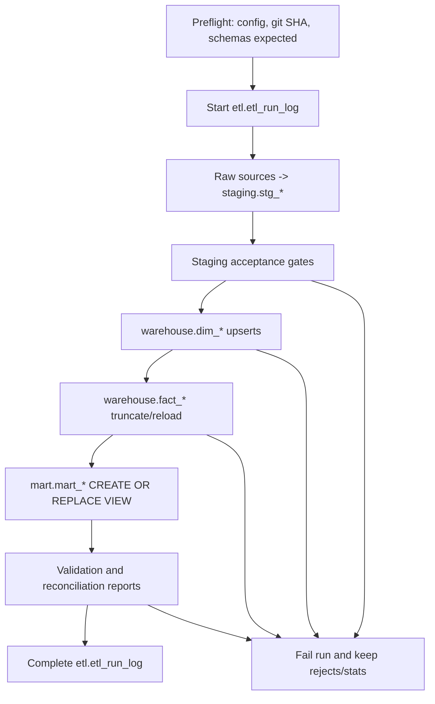

# BI-09 - ETL Implementation Plan

**Task:** BI-09  
**Scope:** raw -> `staging` -> `warehouse` -> `mart`  
**Status:** draft plan only; no ETL was run and no PostgreSQL DDL was executed.

---

## 1. Purpose and Hard Boundaries

This plan extends the existing prototype ETL under
`DataWareHouse/processus_de_vente/etl/scripts/*.py` so the same business logic can
load the corrected PostgreSQL schemas:

- `staging` for `stg_*` raw mirrors.
- `warehouse` for `dim_*` and `fact_*` star-schema objects.
- `mart` for BI-08 `mart_*` views.
- `etl` for control-plane tables: `etl_run_log`, `etl_run_table_stats`, and
  append-only `etl.stg_rejects`.

Hard boundaries for BI-09:

- Do not run the full ETL.
- Do not load multi-GB files into memory.
- Do not write to `business`.
- Do not run DDL against PostgreSQL.
- Keep BI-06/07/08 SQL artifacts draft-only until an explicit implementation task.

---

## 2. Existing Prototype Reuse Map

| Existing script | Current behavior | BI-09 plan |
|---|---|---|
| `inspect_sources.py` | Samples selected source files into JSON. | Keep as a lightweight diagnostics tool; do not use it for the production load path. Superseded by BI-01/02/03 profiles for source decisions. |
| `extract_sources.py` | Reads all configured CSV/XLSX sources into pandas DataFrames and writes `etl/output/staging/*.csv`. | Reuse config loading, path resolution, source naming, and column-standardization helpers. Supersede all-at-once pandas reads with streamed CSV reads and `openpyxl` read-only batches for large XLSX files. Add PostgreSQL `COPY`/batched insert target in implementation. |
| `transform_dimensions.py` | Builds CSV dimension outputs with surrogate keys and UNKNOWN row `0`. | Reuse dimension semantics, date-key generation, primary-supplier selection concept, and UNKNOWN row behavior. Supersede DataFrame-only output with SQL upserts into `warehouse.dim_*` by natural key. |
| `transform_facts.py` | Builds CSV facts and older prototype marts. | Reuse fact grain, dimension lookup mapping, date-key rules, `ISPAID`, and line/header amount choices. Supersede prototype `build_marts()` with BI-08 `docs/bi-service-roadmap/sql/marts.sql`. |
| `validate_etl.py` | Validates CSV outputs and writes `etl/validation/etl_validation_report.{json,md}`. | Extend to PostgreSQL checks against `staging`, `warehouse`, and `mart`; keep the same report path and publish a copy to `docs/warehouse/WAREHOUSE_VALIDATION.md`. |
| `run_etl.py` | Orchestrates extract -> dimensions -> facts -> marts -> validation and writes JSON log. | Keep as the future orchestration entry point. Add `etl_run_id`, DB transaction boundaries, table stats, reject flushing, and acceptance-gate fail/abort logic. |

No optional code stubs are created in BI-09 because the concrete plan is sufficient
and executable implementation is intentionally deferred.

---

## 3. Source and Rule Baseline

The implementation must preserve these prior decisions:

- **Canonical source set and dedup:** BI-01/BI-05 `DEDUP-00`; load authorised
  2024 XLSX and 2025-2026 CSV sources into staging with `_source_tag`, then dedup
  during warehouse load by entity primary key.
- **TRAP-01:** `57_COMMERCIAL_CUSTOMER_PORTFOLIO_24M.xlsx` is permanently excluded
  from all ETL. CA comes from `C_ORDER.GRANDTOTAL` and `C_INVOICE.GRANDTOTAL`,
  not portfolio CA columns.
- **Large-file rules:** never read `2024_16_M_PRODUCT.xlsx` (2,272 MB) or
  `2024_18_M_PRODUCT_PO.xlsx` (995 MB); use `M_PRODUCT.csv` and
  `M_PRODUCT_PO.csv` only. Chunk `2024_02_C_ORDERLINE.xlsx` (253 MB),
  `2024_06_M_INOUTLINE.xlsx` (132 MB), and `2024_04_C_INVOICELINE.xlsx`
  (80 MB) with read-only 5,000-row batches.
- **Business filters:** apply `DOCSTATUS`/doctype filters during warehouse load,
  not during raw staging load.
- **Nullable invoice bridge:** `C_INVOICE.C_ORDER_ID` null is valid; use `LEFT JOIN`
  and do not reject it.
- **Paid/unpaid:** derive paid and unpaid invoice counts from `ISPAID`.
- **Unknown keys:** unresolved optional dimension references map to key `0`.
- **Cleaning and quality rules:** BI-05 rules `ENC-01..03`, `TYP-01..05`,
  `FK-NULL-01`, `DEDUP-00`, `DEDUP-SUPP-01`, `FILT-01..11`, `SENT-01`,
  `NORM-01..08`, `DATE-01..03`, `CUR-01..03`, and `TRAP-01` are mandatory.

---

## 4. Job DAG

### 4.1 Run Order

1. Preflight: load `etl_config.json`, compute `etl_run_id`, record git SHA, verify
   source files exist, and confirm no excluded TRAP files are in the load manifest.
2. Insert `etl.etl_run_log(status='RUNNING', source_tag='mixed')`.
3. Truncate `staging.stg_*` tables only; do not truncate `etl.stg_rejects`.
4. Load raw sources into `staging.stg_*`.
5. Apply staging acceptance gates.
6. Upsert dimensions in dependency order.
7. Truncate/reload facts in dependency order.
8. Create/replace BI-08 plain views from `marts.sql`.
9. Run validation and reconciliation.
10. Mark `etl.etl_run_log` `SUCCESS` or `FAILED`; write table stats either way.

---

## 5. Raw to Staging Jobs

Staging preserves raw values plus BI-06 metadata columns:
`_source_file`, `_source_row`, `_source_tag`, `_loaded_at`, `_etl_run_id`.

| Job | Reuses/supersedes | Inputs | Output | Key | Read strategy |
|---|---|---|---|---|---|
| `load_stg_c_order` | extend `extract_sources.load_sources`; supersede in-memory full read | `C_ORDER.csv`, `2024_01_C_ORDER.xlsx` | `staging.stg_c_order` | `(c_order_id, _source_tag)` | CSV streaming; small XLSX read-only batches |
| `load_stg_c_orderline` | extend `extract_sources`; chunked replacement | `C_ORDERLINE.csv`, `2024_02_C_ORDERLINE.xlsx` | `staging.stg_c_orderline` | `(c_orderline_id, _source_tag)` | CSV chunks; XLSX read-only 5,000-row batches |
| `load_stg_c_invoice` | extend `extract_sources` | `C_INVOICE.csv`, `2024_03_C_INVOICE.xlsx` | `staging.stg_c_invoice` | `(c_invoice_id, _source_tag)` | CSV streaming; small XLSX read-only batches |
| `load_stg_c_invoiceline` | extend `extract_sources`; chunked replacement | `C_INVOICELINE.csv`, `2024_04_C_INVOICELINE.xlsx` | `staging.stg_c_invoiceline` | `(c_invoiceline_id, _source_tag)` | CSV chunks; XLSX read-only 5,000-row batches |
| `load_stg_m_inout` | extend `extract_sources` | `M_INOUT.csv`, `2024_05_M_INOUT.xlsx` | `staging.stg_m_inout` | `(m_inout_id, _source_tag)` | CSV streaming; small XLSX read-only batches |
| `load_stg_m_inoutline` | extend `extract_sources`; chunked replacement | `M_INOUTLINE.csv`, `2024_06_M_INOUTLINE.xlsx` | `staging.stg_m_inoutline` | `(m_inoutline_id, _source_tag)` | CSV chunks; XLSX read-only 5,000-row batches |
| `load_stg_c_payment` | extend `extract_sources` | `C_PAYMENT.csv`, `2024_07_C_PAYMENT.xlsx` | `staging.stg_c_payment` | `(c_payment_id, _source_tag)` | CSV streaming; small XLSX |
| `load_stg_c_allocationhdr` | extend `extract_sources` | `C_ALLOCATIONHDR.csv`, `2024_08_C_ALLOCATIONHDR.xlsx` | `staging.stg_c_allocationhdr` | `(c_allocationhdr_id, _source_tag)` | CSV streaming; small XLSX |
| `load_stg_c_allocationline` | extend `extract_sources` | `C_ALLOCATIONLINE.csv`, `2024_09_C_ALLOCATIONLINE.xlsx` | `staging.stg_c_allocationline` | `(c_allocationline_id, _source_tag)` | CSV streaming; small XLSX |
| `load_stg_c_bpartner` | extend `extract_sources` | `C_BPARTNER.csv`, `2024_10_C_BPARTNER.xlsx` | `staging.stg_c_bpartner` | `(c_bpartner_id, _source_tag)` | CSV streaming; small XLSX |
| `load_stg_c_bpartner_vendor` | extend `extract_sources` | `C_BPARTNER_VENDOR.csv`, `2024_19_C_BPARTNER_VENDORS.xlsx` | `staging.stg_c_bpartner_vendor` | `(c_bpartner_id, _source_tag)` | CSV streaming; XLSX optional if source remains approved |
| `load_stg_c_bpartner_location` | extend `extract_sources` | `C_BPARTNER_LOCATION.csv`, `2024_11_C_BPARTNER_LOCATION.xlsx` | `staging.stg_c_bpartner_location` | `(c_bpartner_location_id, _source_tag)` | CSV streaming; small XLSX |
| `load_stg_c_location` | extend `extract_sources` | `C_LOCATION.csv`, `2024_12_C_LOCATION.xlsx` | `staging.stg_c_location` | `(c_location_id, _source_tag)` | CSV streaming; small XLSX |
| `load_stg_m_product` | extend `extract_sources`; enforce TRAP file rule | `M_PRODUCT.csv` only | `staging.stg_m_product` | `(m_product_id, _source_tag)` | CSV chunks only; never XLSX 2,272 MB |
| `load_stg_m_product_po` | extend `extract_sources`; enforce TRAP file rule | `M_PRODUCT_PO.csv` only | `staging.stg_m_product_po` | `(m_product_id, c_bpartner_id, _source_tag)` | CSV chunks only; never XLSX 995 MB |
| `load_stg_rv_storage` | extend `extract_sources` | `RV_STORAGE.csv`, approved stock snapshot source if present | `staging.stg_rv_storage` | `(m_product_id, m_attributesetinstance_id, m_warehouse_id, m_locator_id, _source_tag)` | CSV chunks |
| `load_stg_ad_user` | extend `extract_sources` | `AD_USER.csv`, `2024_15_AD_USER_SALESREPS.xlsx` | `staging.stg_ad_user` | `(ad_user_id, _source_tag)` | CSV streaming; small XLSX |
| `load_stg_small_dims` | extend `extract_sources` | product category/theme/type/collection, doctype, payment term, price list, region, city, sales region, warehouse | matching `staging.stg_*` tables | entity PK + `_source_tag` | small XLSX/CSV; collection may use chunks if memory pressure appears |

Staging loaders log `NULL_PK`, `INVALID_FLAG`, `ENCODING_ERROR`,
`DATE_OUT_OF_RANGE`, and `CA_TRAP_SOURCE` to `etl.stg_rejects`. Duplicate lower
preference rows are logged later during warehouse dedup as `DUPLICATE_PK`.

---

## 6. Warehouse Dimension Jobs

Dimension jobs use SCD1 upserts by natural key and preserve UNKNOWN key `0`.
They are not truncate-reloaded by default because downstream facts reference
surrogate keys. If a full rebuild is explicitly approved later, dims can be
rebuilt inside one transaction before facts reload.

| Job | Reuses/supersedes | Inputs | Output | Upsert key | Notes |
|---|---|---|---|---|---|
| `upsert_dim_date` | reuse `transform_dimensions.build_dim_date` | min/max dates from order, invoice, delivery, allocation, payment, stock | `warehouse.dim_date` | `date_key` | Cover 2024-01-01 through 2026-12-31 minimum; keep row `0`. |
| `upsert_dim_customer` | reuse customer build logic | `stg_c_bpartner` | `warehouse.dim_customer` | `c_bpartner_id` | Apply `FILT-07/08`, `NORM-01..06`, SCD1 overwrite, UNKNOWN row. Customer group enrichment remains optional because BI-06 did not define a `stg_c_bp_group` table. |
| `upsert_dim_commercial` | reuse commercial build logic | `stg_ad_user`, salesrep IDs in `stg_c_order` | `warehouse.dim_commercial` | `ad_user_id` | Apply `FILT-10`, trim/initcap names, keep unknown key `0`. |
| `upsert_dim_product_category` | reuse category build logic | `stg_m_product_category` | `warehouse.dim_product_category` | `m_product_category_id` | Apply tab/newline cleanup from `NORM-02`. |
| `upsert_dim_supplier` | reuse supplier/vendor build logic | `stg_c_bpartner_vendor`, `stg_m_product_po` | `warehouse.dim_supplier` | `c_bpartner_id` | Supplier candidates come from vendors and product-PO relationships. |
| `upsert_dim_product` | reuse product build logic | `stg_m_product`, category/type/theme/collection, primary supplier | `warehouse.dim_product` | `m_product_id` | `M_PRODUCT.csv` only; apply `FILT-09`; supplier via `DEDUP-SUPP-01`. |
| `upsert_dim_sales_region` | reuse region build logic | `stg_c_salesregion` | `warehouse.dim_sales_region` | `c_salesregion_id` | SCD1. |
| `upsert_dim_geography` | reuse geography merge logic | `stg_c_bpartner_location`, `stg_c_location`, `stg_c_region`, `stg_c_city`, `dim_sales_region` | `warehouse.dim_geography` | `(c_bpartner_location_id, c_location_id)` | Optional geographic fields may map to UNKNOWN, not reject. |
| `upsert_dim_payment_term` | reuse payment term build logic | `stg_c_paymentterm` | `warehouse.dim_payment_term` | `c_paymentterm_id` | SCD1. |
| `upsert_dim_price_list` | reuse price list build logic | `stg_m_pricelist` | `warehouse.dim_price_list` | `m_pricelist_id` | SCD1; MAD singleton stays as source value. |
| `upsert_dim_document_type` | reuse document type build logic | `stg_c_doctype` | `warehouse.dim_document_type` | `c_doctype_id` | Apply `FILT-11`; delivery doc types can resolve to UNKNOWN if excluded. |
| `upsert_dim_warehouse` | reuse warehouse/location build logic | `stg_m_warehouse`, locator source if materialized | `warehouse.dim_warehouse` | `(m_warehouse_id, m_locator_id)` | Preserve locator grain required by BI-07. |

Dedup during dimension load uses BI-05 source preference. For conflicting source
rows, keep the preferred row and insert a `DUPLICATE_PK` info record into
`etl.stg_rejects` with the discarded `_source_tag`.

---

## 7. Warehouse Fact Jobs

Fact jobs are truncate-reload because their grain is stable and every run should
fully reflect the latest staged source set. Load facts only after all dimensions
are current.

| Job | Reuses/supersedes | Inputs | Output | Grain/key | Required filters and joins |
|---|---|---|---|---|---|
| `reload_fact_sales_order` | reuse `transform_facts.fact_sales_order` mapping | `stg_c_order`, dims | `warehouse.fact_sales_order` | `c_order_id` | `FILT-01/02`; `ca_commande` source is `grandtotal`; map missing dims to `0`. |
| `reload_fact_sales_order_line` | reuse order-line mapping | `stg_c_orderline`, `stg_c_order`, `dim_product` | `warehouse.fact_sales_order_line` | `c_orderline_id` | Header context from `stg_c_order`; line amount from `linenetamt`; product/category/supplier lookup from dims. |
| `reload_fact_invoice` | reuse invoice mapping | `stg_c_invoice`, dims | `warehouse.fact_invoice` | `c_invoice_id` | `FILT-03/04`; `source_c_order_id` nullable; `is_paid` from `ISPAID`; CA source is `grandtotal`. |
| `reload_fact_invoice_line` | reuse invoice-line mapping | `stg_c_invoiceline`, `stg_c_invoice`, `dim_product` | `warehouse.fact_invoice_line` | `c_invoiceline_id` | `LEFT JOIN` to order-line bridge; line amount from `linenetamt`. |
| `reload_fact_delivery` | reuse delivery header mapping | `stg_m_inout`, dims | `warehouse.fact_delivery` | `m_inout_id` | `FILT-05/06`; doc type may map to UNKNOWN. |
| `reload_fact_delivery_line` | reuse delivery-line mapping | `stg_m_inoutline`, `stg_m_inout`, `dim_product`, `dim_warehouse` | `warehouse.fact_delivery_line` | `m_inoutline_id` | Locator-aware warehouse key; left join optional order-line bridge. |
| `reload_fact_payment_allocation` | reuse allocation mapping | `stg_c_allocationline`, `stg_c_allocationhdr`, `stg_c_payment`, `fact_invoice` | `warehouse.fact_payment_allocation` | `c_allocationline_id` | Commercial resolves through invoice when possible, otherwise UNKNOWN. |
| `reload_fact_stock_snapshot` | reuse stock mapping | `stg_rv_storage`, `dim_product`, `dim_warehouse` | `warehouse.fact_stock_snapshot` | `(snapshot_date_key, m_product_id, m_attributesetinstance_id, m_warehouse_id, m_locator_id)` | Semi-additive; snapshot date from source/manifest, unknown date only if source missing. |

After each fact load, write `etl.etl_run_table_stats` with rows read, inserted,
rejected, skipped, and duration. Facts must not read from or write to `business`.

---

## 8. Mart Jobs and BI-08 Coverage

BI-08 chose plain `VIEW`s. The ETL implementation therefore does not insert rows
into mart tables; it applies `CREATE SCHEMA IF NOT EXISTS mart` and
`CREATE OR REPLACE VIEW mart.mart_*` from `docs/bi-service-roadmap/sql/marts.sql`
after warehouse facts finish.

| BI-08 mart | Depends on planned outputs | Reachable? |
|---|---|---|
| `mart.mart_sales_daily` | `fact_sales_order`, `fact_invoice`, `dim_date` | Yes |
| `mart.mart_sales_monthly` | `mart_sales_daily` | Yes |
| `mart.mart_sales_by_commercial` | `fact_sales_order`, `fact_invoice`, `dim_date`, `dim_commercial` | Yes |
| `mart.mart_sales_by_customer` | `fact_sales_order`, `fact_invoice`, `dim_date`, `dim_customer`, `dim_commercial`, `dim_geography` | Yes |
| `mart.mart_sales_by_product` | `fact_invoice_line`, `fact_stock_snapshot`, `dim_date`, `dim_product`, `dim_product_category`, `dim_supplier`, `dim_customer` | Yes |
| `mart.mart_sales_by_region` | `fact_invoice`, `dim_date`, `dim_geography`, `dim_sales_region` | Yes |
| `mart.mart_order_to_invoice_flow` | `fact_sales_order_line`, `fact_invoice_line`, `dim_date`, `dim_document_type`, `dim_commercial` | Yes |
| `mart.mart_payment_status` | `fact_invoice`, `fact_payment_allocation`, `dim_date`, `dim_customer`, `dim_commercial` | Yes |
| `mart.mart_stock_risk` | `fact_stock_snapshot`, `dim_date`, `dim_product`, `dim_product_category`, `dim_supplier`, `dim_warehouse` | Yes |

Coverage gate: the run cannot be marked successful if any BI-08 mart definition
references a missing `warehouse.dim_*` or `warehouse.fact_*` output.

---

## 9. Idempotency Strategy

| Layer | Strategy | Rationale |
|---|---|---|
| `etl.etl_run_log` | append one row per run, update status at completion | Audit trail. |
| `etl.etl_run_table_stats` | append rows per table per run | Audit trail and performance trend. |
| `etl.stg_rejects` | append-only; never truncate | Reject history by `etl_run_id`. |
| `staging.stg_*` | truncate/reload all staging tables at run start | Staging mirrors the current canonical raw set; rerun produces identical content. |
| `warehouse.dim_*` | SCD1 upsert by natural key; insert unknown key `0` before normal rows | Stable surrogate keys for facts; future SCD2 columns remain placeholders. |
| `warehouse.fact_*` | truncate/reload facts after dimensions upsert | Facts are deterministic aggregates/records from staging and current dims. |
| `mart.mart_*` | `CREATE OR REPLACE VIEW` | BI-08 uses plain views, so no refresh state is needed. |

Abort behavior: if a phase fails, leave prior successful committed layers intact
unless the failure occurs inside that phase transaction. Mark the run `FAILED`;
do not mark partially loaded data as successful. Future implementation can choose
single-transaction warehouse loads for stricter atomicity if runtime is acceptable.

---

## 10. Streaming and Chunking Design

Implementation should introduce iterator-style readers rather than returning a
single DataFrame for every source:

- `iter_csv_rows(path, chunksize=50_000, encoding='utf-8-sig')` for CSV sources.
- `iter_xlsx_rows(path, batch_size=5_000)` using `openpyxl.load_workbook(...,
  read_only=True, data_only=True)` for XLSX sources.
- `normalize_headers()` reuses `standardize_column_name()` from `extract_sources.py`.
- `copy_chunk_to_staging()` writes each chunk with run metadata and records stats.
- Chunk failures write rejects for the failed rows when row-level recovery is
  possible; otherwise fail the table with a logged error and abort the run.

Large-file constraints:

- `2024_16_M_PRODUCT.xlsx` and `2024_18_M_PRODUCT_PO.xlsx` must be absent from the
  active manifest. Their presence triggers `CA_TRAP_SOURCE`-style manifest failure
  with a clearer code such as `EXCLUDED_LARGE_XLSX`.
- 80-253 MB XLSX files are processed in 5,000-row batches only.
- No plan step requires holding all order lines, invoice lines, delivery lines, or
  product master rows in memory.

---

## 11. Data Quality and Reject Store

Reject rows go to `etl.stg_rejects` with `etl_run_id`, source table/file/row,
PK value, reason code, detail, and a compact raw-row JSON payload. For very wide
rows, store only key columns and the failed column/value pair in `reject_detail`.

Required reject/warning reasons:

| Code | Stage | Handling |
|---|---|---|
| `NULL_PK` | staging | Hard reject row. |
| `ZERO_FK_UNRESOLVABLE` | staging/warehouse | Hard reject only when FK is required and no UNKNOWN/NULLIF rule applies. |
| `DATE_OUT_OF_RANGE` | staging | Hard reject row. |
| `INVALID_FLAG` | staging | Coerce to NULL where allowed, log warning. |
| `DOCSTATUS_FILTERED` | warehouse | Exclude from fact load, log soft reject. |
| `CA_TRAP_SOURCE` | preflight | Exclude entire file and fail manifest if configured as active input. |
| `ENCODING_ERROR` | staging | Replace non-printable text with `?`, log warning. |
| `DUPLICATE_PK` | warehouse dedup | Keep preferred row, log discarded row as info. |
| `EXCLUDED_LARGE_XLSX` | preflight | Fail if the 2,272 MB product XLSX or 995 MB product-PO XLSX is active. |

Acceptance gates inherited from BI-05:

- For transactional staging tables, `rows_rejected / rows_read < 0.05`; otherwise
  abort and mark the run `FAILED`.
- Mandatory staging tables must have `rows_inserted > 0`:
  `stg_c_order`, `stg_c_invoice`, `stg_m_product`, `stg_c_bpartner`.
- Financial totals must reconcile within the BI-09 implementation tolerance:
  source grand totals -> facts -> marts within 0.5%, with expected zero gap for
  unfiltered completed/closed rows.
- No rejected `DOCSTATUS` values can appear in facts.
- Every fact date key must resolve to `warehouse.dim_date` or be the known
  UNKNOWN key `0` where explicitly allowed.

---

## 12. Validation Report

Extend `validate_etl.py` into a PostgreSQL-aware validation command. It writes:

- Runtime JSON: `DataWareHouse/processus_de_vente/etl/validation/etl_validation_report.json`
- Runtime Markdown: `DataWareHouse/processus_de_vente/etl/validation/etl_validation_report.md`
- Published roadmap report: `docs/warehouse/WAREHOUSE_VALIDATION.md`

Required report sections:

1. Run metadata: `etl_run_id`, git SHA, source manifest, start/end times, status.
2. Staging row counts by table and source tag.
3. Reject-rate table with BI-05 acceptance gates.
4. Dimension row counts and UNKNOWN-key profiles.
5. Fact row counts vs deduped staging source counts.
6. Financial totals: `C_ORDER.GRANDTOTAL`, `C_INVOICE.GRANDTOTAL`,
   line-net totals, payment allocation totals.
7. Paid/unpaid invoice counts from `ISPAID`.
8. Nullable bridge profile for `C_INVOICE.C_ORDER_ID` and invoice-line
   `C_ORDERLINE_ID`; expected left-join gaps are warnings, not failures.
9. Mart coverage and row-count checks for all nine BI-08 views.
10. Overall result: `PASS`, `WARN`, or `FAIL`.

---

## 13. Implementation Sequence

The future implementation task should be split into small commits:

1. Add PostgreSQL connection/config helpers and non-running unit tests for config
   parsing and source manifest validation.
2. Refactor `extract_sources.py` into streaming row iterators while preserving
   existing CSV output behavior for local prototype runs.
3. Add staging load functions and unit tests for metadata columns, encoding, PK
   validation, and reject flushing.
4. Add dimension upsert SQL functions and tests for SCD1/UNKNOWN behavior.
5. Add fact reload SQL functions and tests for filters, nullable bridges, and
   amount sources.
6. Add mart apply step that executes BI-08 `marts.sql` only in approved runs.
7. Extend `validate_etl.py` for PostgreSQL reconciliation.
8. Wire `run_etl.py` orchestration, run logging, and acceptance gates.

Testing shape should follow the python-testing-patterns AAA style:

- Unit tests for header normalization, type coercion, rule evaluation, and reject
  classification.
- Integration tests against a disposable PostgreSQL database or transaction-rolled
  schema, using tiny fixtures instead of production extracts.
- Idempotency tests that run the same tiny fixture twice and assert stable row
  counts, totals, and surrogate-key behavior.

---

## 14. Non-Goals for BI-09

- No dashboard/API repointing.
- No Superset or forecasting changes.
- No production ETL run.
- No PostgreSQL DDL execution.
- No changes to `business`.
- No rewrite of the prototype ETL from scratch.
